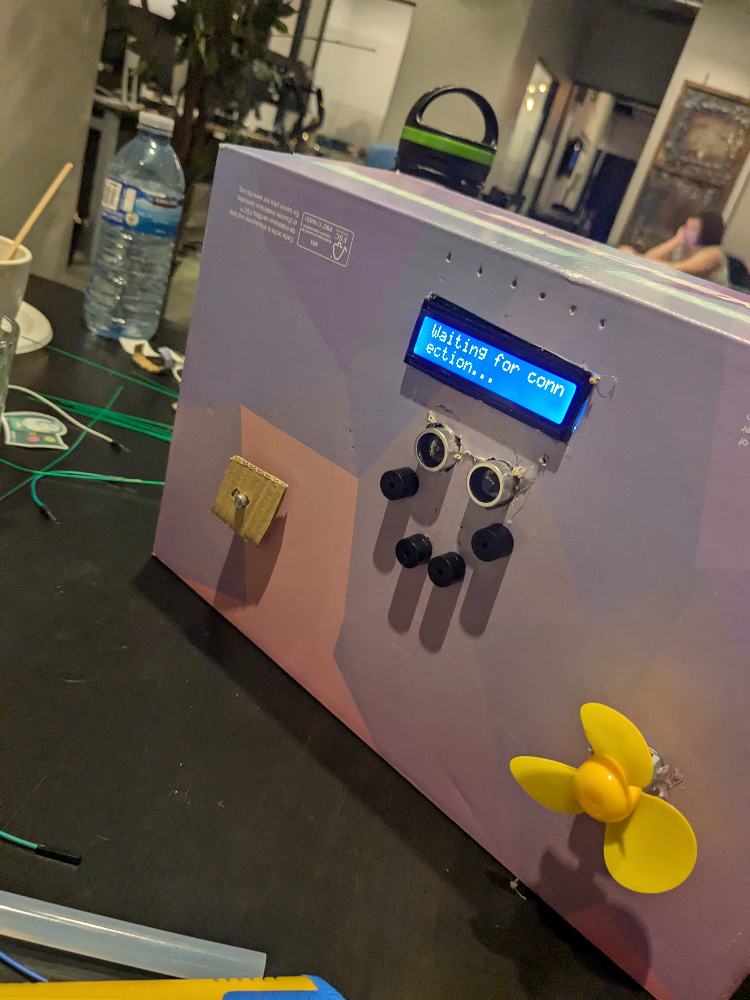
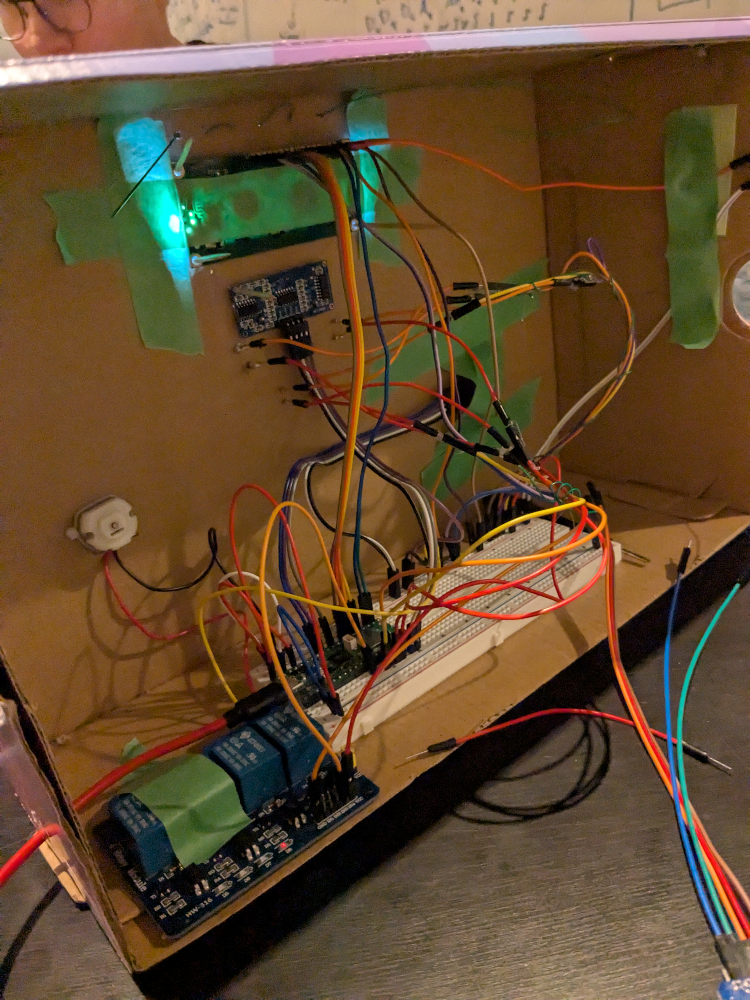

# Global Alarm Clock
A project made for HackClub's Scrapyard Hamilton that won first place.

The idea: get paid to let people wake you up at a random time. 

We made a fully functioning alarm clock with a screen, speakers, a fan, a control system, internet connectivity, and a payment website.

